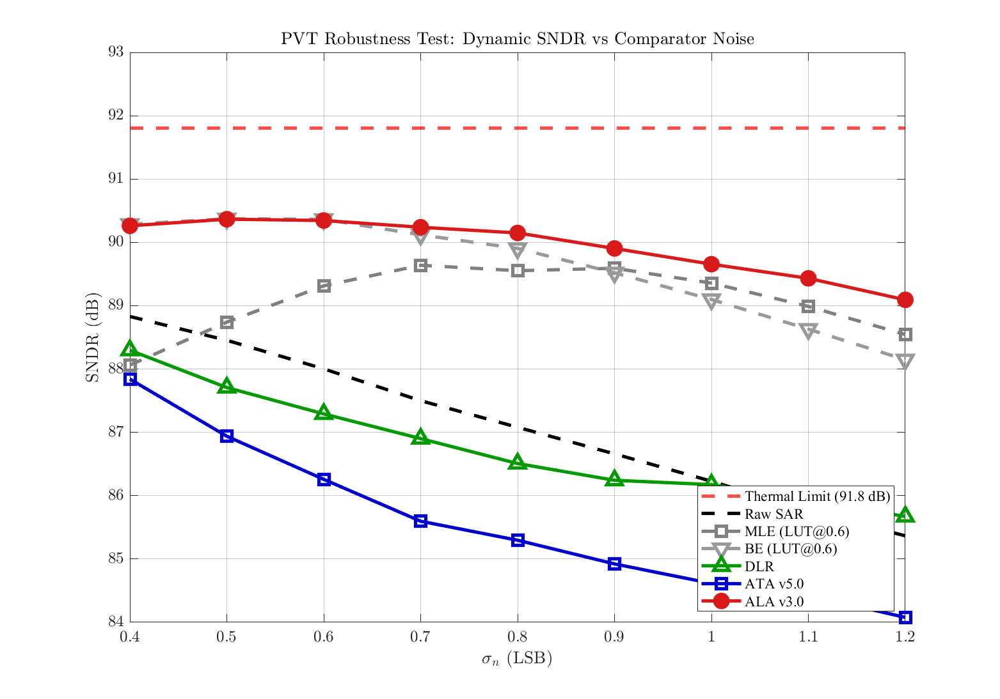

# 报告文档管理规范

本目录用于存放SAR ADC验证项目的所有技术报告文档，采用语义化版本管理。

---

## 目录结构

```
Reports/
├── README.md                                    # 本文件（管理规范）
├── SAR_ADC_Verification_Report_v1.0.0.md        # 主技术报告 v1.0.0
└── archive/                                     # 历史版本归档
    └── (旧版本报告)
```

---

## 版本命名规范

### 语义化版本号

采用 `vMAJOR.MINOR.PATCH` 格式：

- **MAJOR**：重大架构变更、新增核心章节
- **MINOR**：新增数据分析、图表更新、章节扩展
- **PATCH**：文字修正、数据校对、格式调整

### 示例

| 版本 | 变更类型 | 说明 |
|------|---------|------|
| v1.0.0 | 初始版本 | 完整技术报告 |
| v1.1.0 | MINOR | 新增假死率分析章节 |
| v1.0.1 | PATCH | 修正SNDR数据表格 |
| v2.0.0 | MAJOR | 重构报告架构，新增功耗分析 |

---

## 报告类型

| 类型 | 命名格式 | 说明 |
|------|---------|------|
| **主技术报告** | `SAR_ADC_Verification_Report_vX.Y.Z.md` | 完整的项目验证报告 |
| **专题分析报告** | `Analysis_[Topic]_vX.Y.Z.md` | 特定主题的深度分析 |
| **实验报告** | `Experiment_[Name]_vX.Y.Z.md` | 单次实验的详细记录 |
| **阶段性报告** | `Progress_[Date]_vX.Y.Z.md` | 项目进展汇报 |

---

## 当前报告列表

| 报告名称 | 版本 | 日期 | 状态 | 描述 |
|---------|------|------|------|------|
| [SAR_ADC_Verification_Report_v1.3.0.md](./SAR_ADC_Verification_Report_v1.3.0.md) | v1.3.0 | 2026-03-05 | ✅ 当前版本 | 完整技术报告（含压缩比详解） |

---

## 版本历史

| 版本 | 日期 | 变更类型 | 主要变更内容 |
|------|------|---------|------------|
| **v1.3.0** | 2026-03-05 | MINOR | 新增5.3.0章节：压缩比的定义与物理意义（约220行），详细解释压缩比定义、物理意义、与SNDR关系、理论极限、核心评估指标原因、数值物理解读、与功耗关系、实际应用价值 |
| **v1.2.0** | 2026-03-05 | MINOR | 新增算法数学模型章节：4.2 ALA算法（150行公式）、4.3 DLR算法（70行公式）、4.4 ATA算法（80行公式）、4.5 HT-LA算法（85行公式）、4.6 MLE/BE算法（90行公式），总字数约35,000字 |
| **v1.1.0** | 2026-03-05 | MINOR | 新增第三章：平台构建代码详解（约10,000字），包含3.1主控脚本架构、3.2核心仿真引擎、3.3动态SAR量化引擎、3.4 FFT频谱分析模块、3.5 LUT生成器、3.6算法调用框架、3.7图表生成模块 |
| **v1.0.0** | 2026-03-05 | INITIAL | 初始版本，完整技术报告（约15,000字），包含执行摘要、平台架构设计、核心算法实现、仿真结果分析、算法性能对比、技术洞察与讨论、结论与建议共7章 |

---

## 数据来源

所有报告数据均来自 `../Results/` 目录下的仿真结果：

| 数据文件 | 内容 |
|---------|------|
| `Report_SAR_Comparison_*.txt` | 仿真报告文本 |
| `Fig_*.png` | 仿真图表 |
| `Data_Dynamic_Results.mat` | 原始数据矩阵 |

---

## 编写规范

### 1. 数据引用

所有数据必须标注来源：

```markdown
**仿真报告原文数据**（Report_SAR_Comparison_20260304_162851.txt 第35-43行）：

\`\`\`
【FFT 频谱分析 (σ=0.8, N=22)】
  Raw SNDR: 89.21 dB
  ...
\`\`\`
```

### 2. 图表引用

所有图表必须关联实际文件：

```markdown

```

### 3. 代码引用

所有代码片段必须标注文件位置：

```markdown
**代码实现**（run_algorithm_comparison.m 第88-92行）：

\`\`\`matlab
kTC_noise = sqrt(2 * k_B * T / C_s);
\`\`\`
```

---

## 更新流程

1. **创建新版本**：复制当前版本报告，更新版本号
2. **记录变更**：在版本历史表格中添加变更说明
3. **归档旧版本**：将旧版本移动到 `archive/` 目录
4. **更新README**：更新当前报告列表

---

## 联系方式

如有问题，请联系项目负责人或查看项目主README。

---

**最后更新**：2026-03-05
